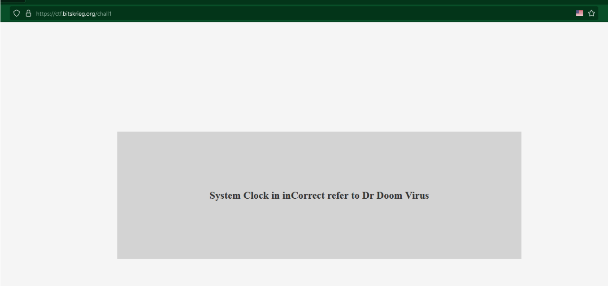
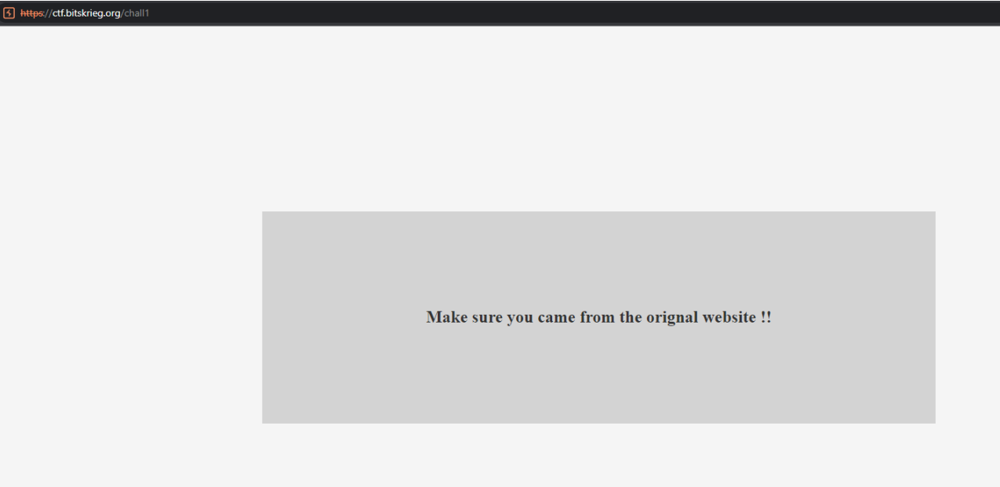
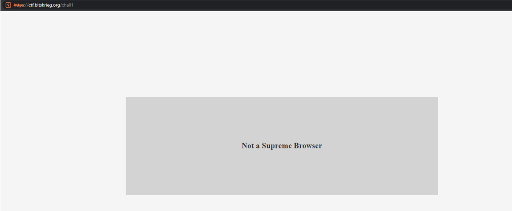
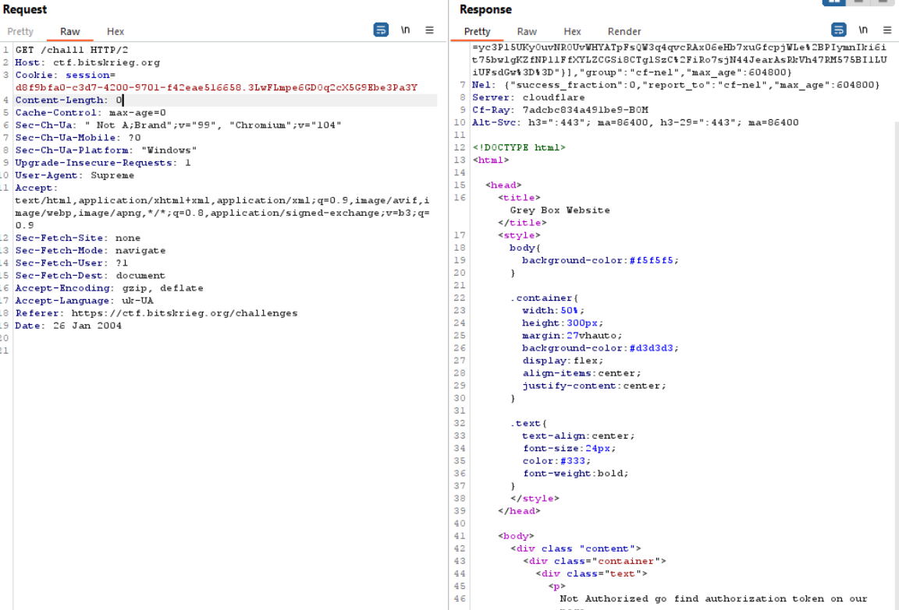
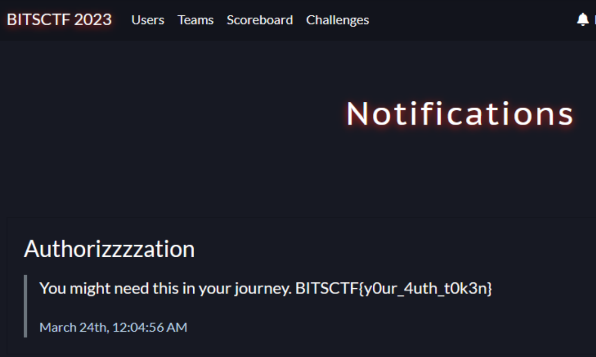
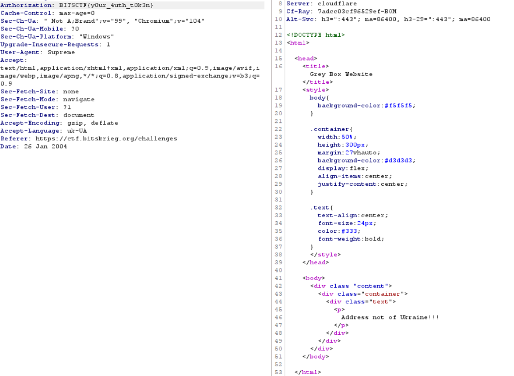
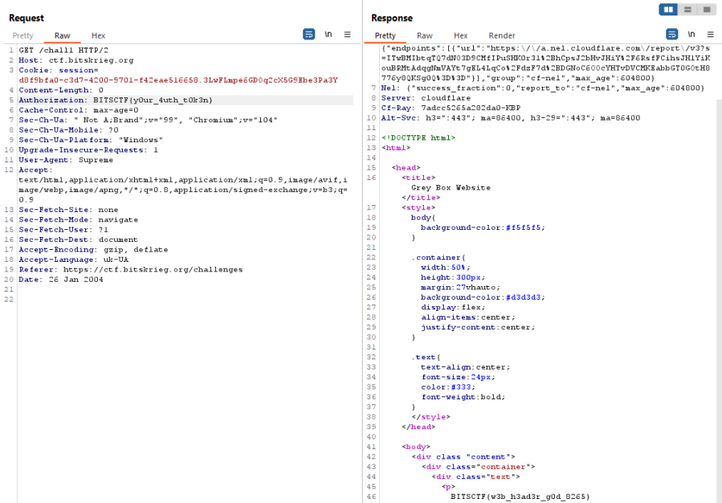

# Writeups ISFCR PESU

### Messed Up

- Pdf file was actually an image, Used a python script to fix headers. Once fixed, image showed a separate layer of white dots. Layer was extracted, and negative space spelt out the flag. Layer was extracted using levels and color based selection on gimp.

### Maze Runner

- An image file of an abnormaly large size was provided indicating that it had stuff hidden in it.
- Runnin binwalk on the image resulted in some folders and images.
- This had to be done multiple times for all the images found within the main image.
- The final image is the portals image which resulted in multiple zip files, one for each zodiac sign. One of them contained the flag as a black text on white background.

### Sounds Weird

- extract lsb from wav file
- pass extracted string to blowfish cipher with key perseverance

### Love at first sight

- given number is a tweet id
  Part 1
- leads to goerli hash
- decompile bytecode of contract
- fetch signature
- github profile of FlaireVoucher
- commit has the first part;

Part 2

- twitter banner has a youtube link
- check link out->check account out
- check yt banner out
- second part of flag

### Mime Spam

- spam encoding
- https://www.spammimic.com/decode.shtml

### Broken TV

- Using Infinite Storage Glitch, a zip archive was extracted from the downloaded YouTube video.
- The file's password was bruteforced using JohnTheRipper with the rockyou.txt wordlist.
- The extracted contents comprised of a bunch of .gpx files which, when plotted at https://gpx.studio gave the flag.

### Self made

- The description gives us the name Tupper and the download is a text file with a long number. A google search leads us to Tupper's Self Referential Formula.
- Entering the number [here](https://keelyhill.github.io/tuppers-formula/) gives us the flag.

### fl0w

- The binary compared the first commandline argument against a string and if the two matched, it printed the flag.
- Patching the binary to remove the string comparison causes it to simply print the flag when run.

### disassemble!!

- Through dynamic analysis, we found that the binary required a numeric password to be passed as the first argument. We also found the error message.
- Since it was Rust binary, finding the main function was not very straighforward. Finding the string 'Wrong!!'(it was part of the message printed when the password was wrong) in the binary and looking at references to it, the correct main function was found.
- Looking at instances in the main function where variables are compared against numbers, the hardcoded numeric password was found.

### cub1x

- The binary first asked for a username. 'admin' turned out to be the correct username and it was hardcoded into the binary. Next it asked for a key.
- By reverse engineering the binary, it was discovered that the program used an array of 24 elements to represent the state of 2x2x2 Rubik's cube. At the start of the program, the cube is shuffled to a predetermined state which can be gathered based on a string in the binary.
- The provided key had to be a sequence of moves in the standard BDFLRU notation which would solve the cube.
- We recreated the program's functionality in Python and through trial and error were able to determine which indices of the array represented which face of the cube.
- Using this information, the required moves were determined using [this](https://github.com/TeodorDyakov/pocket-cube-solver) solver found on Github.

### Heads up

- Opening with burp gives an error

  

- Using referer - `Referer: https://ctf.bitskrieg.org/challenges` fixes it

- System clock suggests there should be some header around it, found a parameter Date, but with the format Day, DD-MM-YYYY HH:MM:SS

- Dr Doom Virus refers to Marvel Cinematic Universe, but checking for computer viruses created using the name, ChatGPT suggested there was a Dr Doom Virus (Computer Virus) targetting IBM computers but it didn't take my anywhere. MyDoom virus is another virus which closely resembles with the name, according to Wiki it was seen on 26th Jan 2004 8 AM EST, giving exact time didn't work, so gave `Date: 26 Jan 2004` which worked!

  

- Asking us to use Supreme browser, Easy! change the User-Agent header to `User-Agent: Supreme`

  

- Requires authorization, The Notifications section of the website gives us the Authorization header

  

- Adding header `Authorization: BITSCTF{y0ur_4uth_t0k3n}`

  

- Address not of ukraine, tried changing Accept Language to uk-UA and adding a mediocre non existent header Address: Ukraine, but didn't work. 

- Then it hit me they might've asked us to use Ukraine's VPN servers. Using NordVPN's Ukraine server, I resent the request and boom!

  

  

  

---

